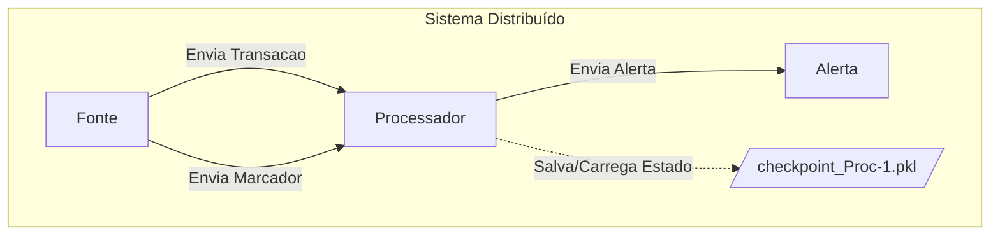
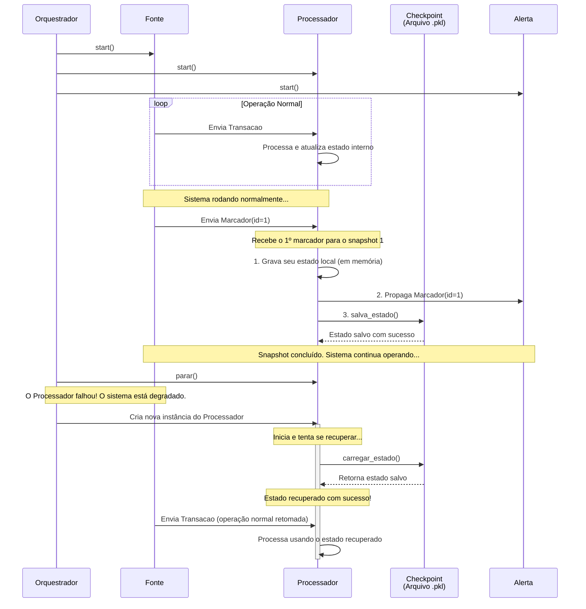

# Simulador de Snapshot Distribuído para Checkpointing e Recuperação

Este projeto é uma simulação em Python que implementa o algoritmo de **snapshot de Chandy e Lamport**. O objetivo é demonstrar uma aplicação prática do algoritmo para criar checkpoints consistentes de um sistema em execução, permitindo a recuperação de falhas sem perda de estado.

A simulação modela um pipeline de processamento de transações financeiras em tempo real, onde a capacidade de salvar e restaurar o estado do sistema é crucial para a tolerância a falhas. Este trabalho foi desenvolvido como parte da disciplina de INE5418 - Computação Distribuída.

## Arquitetura do Sistema

O sistema é composto por três tipos de nós que se comunicam através de canais (filas). A arquitetura geral é a seguinte:



### Componentes:
* **Fonte**: Nó responsável por gerar continuamente dados de transações financeiras e por iniciar o processo de snapshot enviando mensagens de `Marcador`.
* **Processador**: O coração do sistema. Ele processa as transações, mantém um estado interno (ex: contagem de transações por conta) e implementa a lógica do algoritmo de snapshot. É o componente que salva e recupera seu estado.
* **Alerta**: Nó final do pipeline, responsável por receber e exibir mensagens de alerta geradas pelo `Processador` quando uma atividade suspeita é detectada.
* **checkpoint\_Proc-1.pkl**: Um arquivo em disco que representa o armazenamento persistente. O `Processador` o utiliza para salvar seu estado durante um checkpoint e para carregá-lo durante a recuperação.

## Fluxo de Execução e Funcionamento

O diagrama de sequência abaixo ilustra a dinâmica do sistema, desde a operação normal até a simulação de uma falha e sua subsequente recuperação.



### Etapas do Processo:

1.  **Operação Normal**:
    * O `Orquestrador` (`main.py`) inicia todos os nós em threads separadas.
    * A `Fonte` envia mensagens de `Transacao` continuamente.
    * O `Processador` recebe essas transações e atualiza seu estado interno.

2.  **Processo de Snapshot (Checkpointing)**:
    * Periodicamente, a `Fonte` inicia um snapshot enviando uma mensagem `Marcador`.
    * Quando o `Processador` recebe o **primeiro** `Marcador` de um determinado snapshot, ele executa as regras do algoritmo de Chandy-Lamport:
        1.  **Grava seu estado local**: Tira uma "foto" instantânea de suas variáveis internas.
        2.  **Propaga o marcador**: Envia a mensagem `Marcador` para os nós seguintes no pipeline (`Alerta`).
        3.  **Salva o estado**: Persiste o estado gravado em disco, criando um checkpoint.
    * O processo continua até que todos os nós tenham participado do snapshot, resultando em um estado global consistente.

3.  **Falha e Recuperação**:
    * O `Orquestrador` simula uma falha "matando" a thread do `Processador`.
    * Após a falha, uma nova instância do `Processador` é criada.
    * Na sua inicialização, o novo `Processador` detecta o arquivo de checkpoint e executa a rotina `carregar_estado()`.
    * O estado interno é restaurado ao ponto do último checkpoint, e o nó retoma o processamento de forma transparente, garantindo a consistência e a resiliência do sistema.

## Como Executar

O projeto é escrito em Python 3 e utiliza apenas bibliotecas padrão.

1.  **Pré-requisitos**: Certifique-se de ter o Python 3 instalado em seu sistema.

2.  **Estrutura de Arquivos**: Organize os arquivos do projeto no mesmo diretório da seguinte forma:
    ```
    .
    ├── main.py
    ├── components.py
    └── data_structures.py
    ```

3.  **Execução**: Abra um terminal, navegue até o diretório do projeto e execute o arquivo principal:
    ```bash
    python main.py
    ```

4.  **Observação**: A simulação iniciará, e você verá os logs de processamento de transações, criação de checkpoints, a simulação da falha e a recuperação do nó `Processador` diretamente no console.

## Tecnologias Utilizadas

* **Python 3**
* **Bibliotecas Padrão**:
    * `threading`: para simular a concorrência dos processos distribuídos.
    * `queue`: para implementar os canais de comunicação de forma segura entre as threads.
    * `pickle`: para serializar e salvar o estado dos objetos Python nos arquivos de checkpoint.
